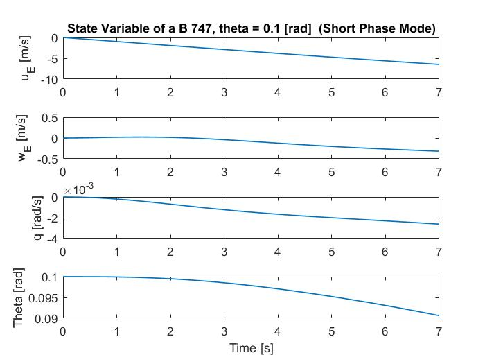

# ASEN 3128 Homework 6

## Problem 1:
Using the non-dimensional data from table 6.1 in the textbook, along with data in table E.1 for case III (for a Boeing 747 airplane), the following dimensional derivatives were computed and are tabulated below. This case was for constant altitude flight.

### Dimensional Derivatives:
|                         | **X [N]**     | **Z [N]**       | **M [m $\cdot$ N]** |
|:-----------------------:|:-------------:|:---------------:|:-------------------:|
| u [$\frac{m}{s}$]       | $-2.209*10^3$ |  $-2.350*10^4$  |  $1.776*10^4$       |
| w [$\frac{m}{s}$]       |  $4.486*10^3$ |  $-1.006*10^5$  |  $-1.742*10^5$      |
| q [$\frac{m}{s}$]       |  0            |  $-5.0404*10^5$ |  $-1.695*10^7$      |
| $\dot{w} [\frac{m}{s}$] |  0            |  $1.891*10^3$   |  $-1.685*10^4$      |

 

## Problem 2:

### For the Linearized Longitudinal set, the following A Matrix was computed using MATLAB:
 

$$
A =
\begin{vmatrix}
-0.0077 & 0.0155 & 0 & -9.81 \\
-0.0820 & -0.3509 & 265.47 & 0\\
4.265E-4 & -0.0037 & -0.477 & 0\\
0 & 0 & 1 & 0\\
\end{vmatrix}
$$

 

## Problem 3:
The eigenvalues and vectors for the linearized longitudinal set was calculated using the relation: $det(\lambda I - A) = 0$. Once the eigenvalues were calculated, they could be classified into their corresponding mode by finding the eigenvalues with the largest real part (magnitude wise). The short period response has a larger real eigenvalue due to the real parts function as a stabilizer. The larger the real part, the quicker the envelope of the oscillation will go to either zero or infinity. Since the real part was larger in magnitude and negative, the real part will drive the oscillations to zero as the $e^{n t}$ part of $e^{n t}\cdot e^{j\omega t}$ dominates (where n is the real part of the eigenvalue $\lambda = n \pm i\omega$). The real part dominates since the imaginary part is just a sinusoidal oscillation, therefore, the real part drives this oscillation's amplitude to its end state. The eigenvectors, eigenvalues, dampening coefficient, and natural frequency were calculated for each mode  using MATLAB and are provided below:
 

$$
\lambda = n \pm i\omega,\,\,\,\,\,\, \zeta = \frac{-n}{\omega_n}  ,\,\,\,\,\,\, \omega_n = \sqrt{(\omega^2+n^2}
$$

 

## Short Period Mode:
 

$$
\lambda_{1,2} = -0.4142 \pm 0.9944i ,\,\,\,\,\,\, \zeta = 0.3845  ,\,\,\,\,\,\, \omega_n = 1.077
$$
 

$$
Eigenvector_1 =
\begin{vmatrix}
0.0155 + 0.0105i \\
0.999 \\
-0.0002+0.0037i \\
0.0033 - 0.0011i\\
\end{vmatrix}
$$
 

$$
Eigenvector_2 =
\begin{vmatrix}
0.0155 - 0.0105i \\
0.999 \\
-0.0002-0.0037i \\
0.0033 + 0.0011i\\
\end{vmatrix}
$$
 

## Phugoid Mode:
 

$$
\lambda_{1,2} = -0.0038 \pm 0.0620i ,\,\,\,\,\,\, \zeta = 0.0605  ,\,\,\,\,\,\, \omega_n = 0.0622
$$
 

$$
Eigenvector_1 =
\begin{vmatrix}
-0.998 \\
-0.0639+0.0072i \\
-3.933E-4 - 5.515E-6 \\
0.0003 + 0.0063i\\
\end{vmatrix}
$$
 

$$
Eigenvector_2 =
\begin{vmatrix}
-0.998 \\
-0.0639 - 0.0072i \\
-3.933E-4 + 5.515E-6 \\
0.0003 - 0.0063i\\
\end{vmatrix}
$$
 

## Problem 4:
When approximating the short period mode using the reduced order model, the simplified set of equations reduces to :

$$
\begin{vmatrix}
\Delta \dot{q} \\
\Delta \dot{\theta}\\
\end{vmatrix}
= 
\begin{vmatrix}
\frac{M_q}{I_y} & \frac{U_0 M_w}{I_y}\\
1 & 0\\
\end{vmatrix}
\begin{vmatrix}
\Delta q \\
\Delta \theta\\
\end{vmatrix}
$$

 
Solving for the eigenvalue of this homogeneous set 2x2 state space model for pitch motion using the relation, $det(\lambda I - A) = 0$, where I is the identity matrix and A is from the model. The corresponding eigenvalues are:
 

$$
\lambda_{1,2} = -0.1888 \pm 0.9973i 
$$
 

 This shows a large discrepancy when comparing the real parts of the eigenvalue from the less simplified case. The real parts of the eigenvalue are the parts that ultimately have the control on the stability as they drive the envelope of the imaginary part. While the real parts were noticed to have a rather large discrepancy, the imaginary part was almost exactly the same from both models. This means that the corresponding period will also be very similar since the imaginary part of the eigenvalues control the period.  
 \newline
 When comparing the oscillation period of the Phugoid mode from problem 2, to the oscillation period given by the Lanchester approximation, it can be seen that the values were much different.
 The oscillation period calculated using the linearized model from problem 2 was calculated using the imaginary part of the eigenvalue, $\omega$, using the following relation: $ T = \frac{2\pi}{\omega}$. The oscillation period calculated using the Lanchester approximation, utilizes conservation of energy to get the relation: $ T = \pi \sqrt{2}\frac{U_0}{g}$, where $U_0$ is the trim state for the the x component of velocity in body frame coordinates. These relations give the following results:
 
  

$$
 T = 101.28 [s] ,\,\,\,\,\,T_{Lanchester} = 120.23 [s] 
$$
 
 
## Problem 5:
 The linearized longitudinal set of state variables, $\Delta u$, $\Delta w$, $\Delta q$, and $\Delta \theta$ were solved for using MATLAB's ODE45 differential equation solver. The set was solved over two different periods of time to analyze the two different modes. First, over a long period of time to analyze the Phugoid mode response and then over a short period of time to see the short phase response of the system. To check that the trim state is an equilibrium state, we check the system about zero perturbations first. This resulted in constant state variables as the trim states will not change in equilibrium. These trim states are plotted first for each mode below. The system is an approximation for a Boeing 747 flying at 40,000 feet with individual perturbations of $\Delta u = 10 [\frac{m}{s}]$, $\Delta w = 10 [\frac{m}{s}]$, $\Delta q = 0.1 [\frac{rad}{s}]$, and $\Delta \theta = 0.1 [rad]$, to see how the system will react. The following plots show the reactions about each of these perturbations.
 
## Phugoid Mode:

No Perturbations:   

$\Delta u = 10 [\frac{m}{s}]$:   

$\Delta w = 10 [\frac{m}{s}]$:   

$\Delta q = 0.1 [\frac{rad}{s}]$:   

$\Delta \theta = 0.1 [rad]$:   

## Short Period Mode:

No Perturbations:   

$\Delta u = 10 [\frac{m}{s}]$:   

$\Delta w = 10 [\frac{m}{s}]$:   

$\Delta q = 0.1 [\frac{rad}{s}]$:   

$\Delta \theta = 0.1 [rad]$:   

After analyzing the plots it can be seen that the short phase mode is more pronounced for perturbations in $Delta w^E$ and $\Delta q$, where the phugoid mode is nearly none existent for the state variables $Delta w^E$ and$\Delta q$ and is largely diminished for $\Delta \theta$ . Perturbations in $\Delta u^E$ and $\theta$ had more pronounced phugoid modes as they system oscillates about trim for a much longer period of time. The short phase mode was still present for the state variables  $Delta w^E$ and$\Delta q$ in the case for a perturbation about $\Delta u^E$.
